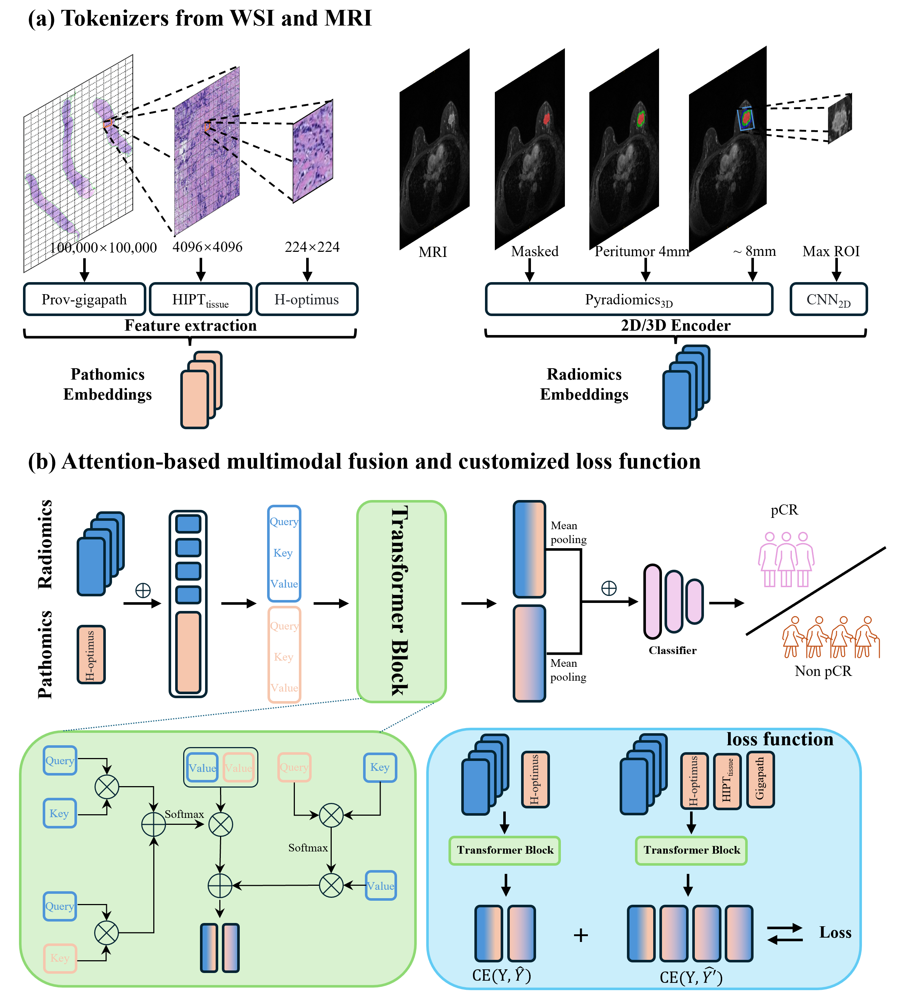

<<<<<<< HEAD
# MuFi: A WSI–MRI Multimodal Fusion Algorithm for Breast Cancer Neoadjuvant Therapy Response Prediction

This repository accompanies our paper **"Attention-based multimodal fusion transformer for predicting the efficacy of neoadjuvant therapy in breast cancer: a cross-institutional retrospective study"**, published in *Breast Cancer Research* (2026) 28:4.

[](https://doi.org/10.1186/s13058-025-02181-9)

<p align="center">
  
</p>

## Highlights

Neoadjuvant chemotherapy (NAC) is a standard treatment for breast cancer, yet only a subset of patients gains significant benefit. Single-modality data often overlook patient heterogeneity. We developed **MuFi** (Multimodal Full Information), an interpretable, attention-based multimodal feature fusion transformer that predicts NAC response (pathological complete response, pCR, vs. non-pCR) by integrating **whole-slide images (WSIs)** and **magnetic resonance imaging (MRI)**.

- **Multimodal fusion across biological scales.** MuFi integrates WSI and MRI data across cell, tissue, and global levels using a hierarchical vision transformer, and uses a radiology-guided co-attention mechanism to model interactions between radiological and histological instances.
- **Memory-efficient transformer.** By treating histology patch embeddings and radiomic subset embeddings as tokens, MuFi fuses both modalities through a single multimodal transformer that captures dense cross-modal interactions.
- **Strong and generalizable performance.** MuFi achieved AUCs of **81.9%** (discovery), **78.5%** (validation), and **79.3%** (external test), outperforming clinical, single-modality, and late-fusion baselines. Integrating clinical data (cT stage, molecular subtype) and an FRMIL-based ensemble (9:1 soft voting) further improved AUCs to **90.2%**, **81.8%**, and **81.6%**.
- **Interpretability.** By fusing pathology and radiology features, MuFi improves decision reliability and identifies critical multimodal prognostic predictors, supporting personalized NAC decision-making.

## Dataset

Data from **567 biopsy-confirmed breast cancer patients** at two institutions were retrospectively analyzed:

- **Discovery / validation cohort** (West China Hospital, SCWCH): 363 patients split 8:2 into training (n=290) and validation (n=73).
- **External test cohort** (Shengjing Hospital of China Medical University, CMUSJH): 204 patients.

Each case includes pre-treatment pathology biopsy WSIs, dynamic contrast-enhanced (DCE) breast MRI, and clinical metadata.

## Method Overview

MuFi has two stages: per-modality tokenization, followed by attention-based multimodal fusion (see Fig. 1 in the paper).

### Pathomics tokenizer (WSI)

- H&E slides digitized at 40× magnification; tissue regions segmented with the [CLAM](https://github.com/mahmoodlab/CLAM) toolbox and non-overlapping tiles of 224×224, 256×256, and 4096×4096 extracted at 20×. Macenko color normalization + white balancing applied for stain robustness.
- Three-level hierarchical pathomics embeddings via self-supervised pretrained extractors:
  - **Cell level** (224×224): [H-optimus](https://github.com/bioptimus/releases)
  - **Tissue level** (4096×4096): [HIPT](https://github.com/mahmoodlab/HIPT)
  - **WSI / global level**: [Prov-Gigapath](https://github.com/prov-gigapath/prov-gigapath)
- Each WSI is treated as a "bag" of patch tokens (multiple-instance learning); patch features saved as `.pt` files.

### Radiomics tokenizer (MRI)

- Pre-treatment DCE-MRI preprocessed with isotropic resampling to 1×1×1 mm³, z-score intensity normalization, and N4 bias-field correction. 3D tumor ROIs segmented and verified by board-certified breast radiologists.
- Features extracted from the 3D ROI, 4 mm and 8 mm peritumoral regions, and the 2D maximum cross-section:
  - Traditional radiomics via **PyRadiomics (v3.1.0)**.
  - Deep features from 2D images via ImageNet-pretrained CNNs (DenseNet, Inception-v3, ResNet, VGG), reduced to 16 principal components by PCA.
- t-test feature selection (p < 0.05) over 3,655 combined features yields **591 radiomic features**, grouped into **202 disjoint subsets**, each projected to a fixed dimension to form interpretable radiomic tokens.

### Multimodal fusion

- Histopathology and radiomic tokens (each D = 256) are concatenated into `(N_r + N_p)` tokens and passed through a self-attention transformer, where tokens from both modalities serve as queries, keys, and values to model dense cross-modal attention.
- A **semantic consistency loss** across full-scale features (H-optimus cell, HIPT4096 tissue, Prov-Gigapath WSI) stabilizes training under sparse WSI-level supervision.
- The final ensemble combines MuFi with FRMIL predictions (9:1 soft voting) and clinical variables (cT stage, molecular subtype).

## Repository Structure

```
.
├── main.py              # Training entry point (5-fold cross-validation)
├── eval.py              # Evaluation / inference
├── models/              # Model definitions (MuFi + MIL / fusion baselines)
│   ├── model_SurvPath.py, model_ABMIL.py, model_TMIL.py, model_FRMIL.py, ...
│   └── layers/          # Cross-attention modules
├── datasets/            # Dataset classes (WSI bags, survival/response loaders)
├── custom_optims/       # LAMB / RAdam optimizers
├── utils/               # Core training loops, args, helpers
├── wsi_core/            # WSI processing utilities
├── vis_utils/           # Visualization / heatmap utilities
├── scripts/             # Training scripts for MuFi and baselines
└── figures/             # Figures and assets
```

## Installation (Linux + Anaconda)

### Prerequisites

- Linux (tested on Ubuntu)
- NVIDIA GPU (training was performed on a single **NVIDIA RTX 4090**)
- Python 3.8

### Key dependencies

PyTorch, h5py, numpy, pandas, scikit-learn, scipy, opencv-python, openslide-python, pillow, matplotlib, PyRadiomics (3.1.0), captum.

## Running Experiments

Training uses 5-fold cross-validation. See the [`scripts`](scripts) folder for training scripts for MuFi and the baselines reported in the paper. A typical run:

```bash
python main.py   # configure arguments via utils/process_args.py or the scripts/ shell files
```

To evaluate a trained model:

```bash
python eval.py
```

**Training configuration** (from the paper): AdamW optimizer, learning rate 5×10⁻⁴, weight decay 1×10⁻⁴, batch size 1 (one slide + its paired radiological image per iteration). Refer to the paper for full hyperparameters.

## Baselines

- **Single-modality histology:** ABMIL, TransMIL, FRMIL
- **Single-modality radiomics:** MLP (ReLU), SNN (ELU + Alpha Dropout), S-MLP
- **Multimodal fusion:** late-fusion concatenation, bilinear pooling, MuFi
- **Ensemble:** MuFi + FRMIL (9:1 soft voting) + clinical variables

## Citation

If you find our work useful in your research, please cite:

```bibtex
@article{zhang2026mufi,
  title={Attention-based multimodal fusion transformer for predicting the efficacy of neoadjuvant therapy in breast cancer: a cross-institutional retrospective study},
  author={Zhang, Wenchuan and Zhang, Shuwan and You, Jiadi and Li, Fengling and Wu, Xiaoyan and Lu, Xunxi and Lv, Qingjie and Huang, Juan and Yi, Yuhao and Bu, Hong},
  journal={Breast Cancer Research},
  volume={28},
  number={4},
  year={2026},
  doi={10.1186/s13058-025-02181-9}
}
```

## Acknowledgements

The model and training pipeline build upon the [SurvPath](https://github.com/mahmoodlab/SurvPath) framework. We thank the authors of [CLAM](https://github.com/mahmoodlab/CLAM), [HIPT](https://github.com/mahmoodlab/HIPT), [Prov-Gigapath](https://github.com/prov-gigapath/prov-gigapath), [H-optimus](https://github.com/bioptimus/releases), and [PyRadiomics](https://github.com/AIM-Harvard/pyradiomics) for their open-source tools.
=======
# MuFi: Multimodal Full information Model

This repository contains the PyTorch implementation of **MuFi**, a model designed for multi-feature integration, specifically optimized for predicting clinical outcomes in breast cancer. MuFi combines radiomics, pathomics, and clinical features to enhance the model's predictive capabilities. This repository also includes necessary scripts, requirements, and instructions for reproducing the results from our study.

## Features
- **Multi-modal data integration**: The model leverages different feature sets, including radiomics, pathomics, and clinical data.
- **Customizable architecture**: The model architecture is modular and can be easily adapted or extended with additional feature sets.
- **Detailed evaluation**: Supports a variety of metrics such as AUC, accuracy, sensitivity, specificity, PPV, and NPV, providing a comprehensive performance assessment.

## To-Do
- [ ] Write detailed documentation for data preprocessing and feature extraction.
- [ ] Upload all source code files.

## Installation
1. Clone this repository:
   ```bash
   git clone https://github.com/Wenchuan-Zhang/MuFi.git
   cd MuFi
>>>>>>> e42d33de4d80a989ccb48cd09c4e1aaa48564c08
